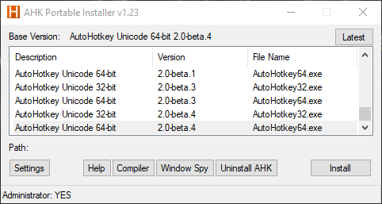

# AHK Portable Installer



README Updated on 2022-06-12

## Latest Updates

* Ahk2Exe is now automatically downloaded, and extracted to install dir if no "Compiler" folder exists.\
MPRESS is currently not included for automatic downloads.

> `Window Spy` is now automatically included as of AHK v2.beta-4

Thanks to lexikos' release of AHK v2-beta.4, I got the idea of a short and direct way to check for Ahk2Exe updates from his code/release.

## Intro

[Posted on AutoHotkey.com Forums](https://www.autohotkey.com/boards/viewtopic.php?f=6&t=73056)

This is a portable install manager and allows multiple versions of AutoHotkey to coexist simultaneously.  <font color="red">This script is meant to work with the portable `.zip` archives of AutoHotkey, NOT the setup `.exe` versions.</font>  It is written in AHK v2.

You can use this program in 1 of 2 ways:
1) Change/Switch the active AHK EXE version when desired.
2) Run multiple version of AHK simultaneously without switching by using the #REQUIRES directive in your scripts.  This program will choose the EXE based on that criteria.

This program can be run as an installer, or as a portable program.  As an installer, registry entries are written to the system to implement the `.ahk` file type association.  In Fully Portable mode no registry modifications are performed, and the program must remain running in the background.

If you want to use AutoHotkey_H with this program, you can.  Simply download your desired release(s) of AutoHotkey_H and extract the ZIP to a subfolder in the `base folder`.

The default `base folder` is in `%A_ScriptDir%\versions`.

## Features
* Download/remove AHK versions directly from the UI.
* Download Ahk2Exe automatically (updates for pre-existing installs are still manual).
* Fully Portable Mode.  See the `Fully Portable Mode` section below.
* Associate the `.ahk` extension with any version of AHK.  (not in portable mode)
* Selectively choose which context-menu items appear in the context menu.  (not in portable mode)
* Associate any text editor with "Edit Script" in context menu easily.  (use SHIFT + MButton in portable mode)
* Define as many versions of AHK as you want to run in parallel.
* Checks for updates when prompted, or does so automatically if enabled.
* Displays the latest versions of AHK v1 and v2 (with internet connection only).
* Displays currently active version of AHK.
* Download official AutoHotkey releases directly from the UI.
* Easily invoke `WindowSpy.ahk`, `help file`, and the `Ahk2Exe` compiler for the selected `base version` from the UI.
* Edit templates for new AutoHotkey.ahk files from GUI.  (not in portable mode)
* Optionally use this program like "AHK-EXE-Switcher" instead of a multi-version Launcher.

## Basic Setup

Grab the latest copy of AHK v2 (currently recommended is beta.1), copy the desired version of `AutoHotkey32/64.exe` into the script dir and rename it to `AHK_Portable_Installer.exe`.  Always run this EXE file to launch the script.

Now you can download AutoHotkey through the UI.  Just click `Settings`, pick a major version from the DropDownList, then select/downlad your desired version(s).  To remove a version of AHK, right click on an entry in the main list, and select `Remove this version` from the context menu.

The AutoHotkey `base folder` is located in the script directory by default.  It can be moved to another location if desired.  The structure of the `base folder` is described below.  All downloads are cached.  You can open the `base folder` and `temp folder` from the Download tab in Settings.

Example:
```
C:\AutoHotkey\   <-- base folder -> place this anywhere you want, or leave it in the script folder
             \_OLD_\old_versions_here...   <-- AHK folders here will not be parsed/listed
             \ahk version blah\...         <-- AHK folders for each version
             \ahk_h another_version\...    <-- AHK folders for each version
             \and_so_on\...                <-- AHK folders for each version
```

Each subfolder should have it's own copy of a `help file`, `WindowSpy.ahk`, and `Compiler` folder with `Ahk2Exe` and all necessary components (like `.bin` files, `mpress.exe`, and/or `upx.exe` as needed).  Note, that `Ahk2Exe Compiler` and `WindowSpy.ahk` are not currently packaged with AutoHotkey v2-beta releases.  See the links in the "Latest Updates" section at the top of this page if you need these components.

Now you need to decide how you want to use this program:
1) Change the version as needed to run different scripts (like AHK-EXE-Switcher).
2) Use the #REQUIRE directive in your scripts (recommended).  You will need to make small changes to your scripts, but you will be able to run multiple versions of AHK simultaneously without switching.  Read more below.
3) You also need to decide if you want to use this program as an installer (registers the `.ahk` extension on the system) or if you want to run in Fully Portable mode.

## Installer Mode

This is the default mode.  Simply leave `Fully Portable Mode` unchecked.  When installing, the `Install For` option in the `Basics` tab determines whether registry modifications are made for the user, or for `All Users` (the system).  You can optionally install for `All Users`, but you need to run this program as Admin.

The `Base Folder`, as described above, is located in `%A_ScriptDir%\versions` by default.  You can move this anywhere you wish, and then specify that folder in the `Base Folder` option.  Leaving this setting blank will use the default folder location.

When you click `Install` the `base version` is set and the script writes registry entries for the `.ahk` extension, and context menu entries (such as Right-Click > New, and "Run Script", "Compile Scrpt", etc).

## Fully Portable Mode

Go to Settings > Options tab and check the `Fully Portable Mode` checkbox.  In this mode no registry entries are written.  You can use the hotkeys below to run and edit scripts.  After you select your desired version click the `Select` button to change the selected base version.

Hotkeys for Fully Portable mode:

|Hotkey         |Description                                           |
| -------------:| ---------------------------------------------------- |
|MButton        |Runs SELECTED script files.                           |
|Shift + MButton|Open script file in specified text editor.            |
|Ctrl + MButton |Open the compiler with the selected script pre-filled.|

If you want to use Fully Portable Mode, then you will also want to consider the following settings in the Options tab:

* Hide Tray Icon (maybe uncheck this - check the rest as desired)
* Close to Tray
* Minimize on Startup
* Run on System Startup

## Using the #REQUIRES directive

Use the #REQUIRES directive in your scripts to have the Launcher dynamically select which AHK EXE to use for running the script.

Example:
```
    SYNTAX:  #Requires [product] [version] [; options]

----------------------------------------------------------------
* Uses a136, with system bitness.

#Requires AutoHotkey 2.0-a136
----------------------------------------------------------------
* Uses the latest v2 alpha on the system and uses only 32-bit.

#Requires AutoHotkey 2.0-a ; 32-bit
----------------------------------------------------------------
* Uses only v2 alpha a138, uses 64-bit and runs script as admin.

#Requires AutoHotkey 2.0-a138 ; 64-bit admin
----------------------------------------------------------------
* For versions of AutoHotkey that don't have
  the #Requires directive, simply comment
  out the directive but format it the same.

; #Requires AutoHotkey 1.1.33 ; 32-bit
----------------------------------------------------------------
```

At a minimum specify the product and the version.  For the most part, how the script selects the EXE to use is the same a the #REQUIRES directive, so please read up on it in the docs, but there are a few differences:

* If you don't specify an exact version, the **latest version** available on the system that matches the #REQUIRES directive is used.
* AHK docs specify that including "AutoHotkey" is optional, but since this script also works with AutoHotkey_H, specifying the product is required.
* If you don't specify a #REQUIRES directive then the selected/installed `base version` is used.

## Compiling Scripts

The #REQUIRES directive is also used to determine which compiler to use.  The logic is the same as the section above.  If no #REQUIRES directive is used, then the selected `base version` compiler is used.

## Setting up Ahk2Exe

All versions of AutoHotkey v1 come with a compiler (Ahk2Exe), `.bin` files, and `mpress.exe`.  These versions of `Ahk2Exe` also work for AutoHotkey v2.  Just copy `Ahk2Exe.exe` and `mpress.exe` from the AHK v1 compiler folder to the AHK v2 compiler folder.  DO NOT copy the `.bin` files from the AHK v1 folder.

The latest versions of AutoHotkey_H v1 and v2, as of this document update, both have their own separate updated compilers which contain `Ahk2Exe.exe`.

So if you were to run all versions of AutoHotkey in parallel (in theory) your compiler setup for each version of AutoHotkey in your base folder should follow these general guidelines:

* All AutoHotkey v1 and v2 folders should have the same latest release of Ahk2Exe, but the `.bin` files will be different.
* All AutoHotkey_H v1 folders should have the same version compiler.  Just replace the older compiler with the newer one.
* All AutoHotkey_H v2 folders should have the same version compiler.  Just replace the older compiler with the newer one.

This setup will allow you to properly compile any version of AutoHotkey you wish to setup on your system.

## Options Tab - Install Options

The below options pertain to using this program as an Installer only.  All other options not discussed either pertain to the Context Menu, or to "Fully Portable Mode".  I gave the below options arbitrary numbers for easy reference in this document.

#### Option #1: `Add to PATH on Install`

This option adds the script directory to the PATH environment variable.  This setting follows the `Install For` option on the `Basics` tab.  This allows the Launcher (`AHK_Portable_Installer.exe`) to be used on the command line.  (See "Command Line Usage" below.)

#### Option #2: `Copy Installed EXE to "AutoHotkey.exe" on Install`

If this option and Option #1 are enabled, then the installed AHK EXE will be copied to the script directory as `AutoHotkey.exe`.  You can then use this on the command line according to the AutoHotkey docs.

Checking this option alone, while copying the installed EXE to the script directory, will basically have no worth while effect on the system.  Normally this option is used with Option #1, Option #3, or both.

#### Option #3: `Register "AutoHotkey.exe" with .ahk files instead of Launcher on Install`

If this option is enabled, then the usage of the #REQUIRES directive as explained above will have no effect.  Only the installed/selected version of AutoHotkey will be used to run `.ahk` scripts.  This effectively turns this program into an "EXE switcher" similar to "AHK-EXE-Swapper".

If you check this option, Option #2 will be automatically checked.  If you uncheck Option #2, then this option will be automatically unchecked.

## Launcher Command Line Usage (AHK_Portable_Installer.exe)

Usage:

```
AHK_Portable_Installer.exe [Behavior] "path\to\script.ahk" [params...]

[Behavior] and [params...] are optional.

Simple usage:
    AHK_Portable_Installer.exe "path\to\script.ahk" [params...]

Specify Behavior:
    AHK_Portable_Installer.exe [Launch|LaunchAdmin|Compiler] "path\to\script.ahk" [params...]
```

If the first parameter is an `.ahk` script file, then the default behavior is `Launch`.  If the behavior is specified as `Launch` and the `Admin` option is used on the `#Requires` directive within the script, then the script will still be launched as admin.

Place parameters to be passed to the script after the `path\to\scrpt.ahk` parameter as usual.

When launching scripts on the command line with `AHK_Portable_Installer.exe` , the script will be launched with an EXE according to the #Requires directive.  If no `#Requires` directive is found, then the script will be launched by the installed/selectd EXE from the main UI.

## What AHK Portable Installer does NOT do...

This is a PORTABLE installer, so this script:

* WILL NOT write or remove registry entries that deal with modifying the App list of installed programs.
* WILL NOT create a separate `.ahk2` extension or any other extension besides `.ahk`.

## Troubleshooting and avoiding problems

If you need help post on the forums, or [visit the join #ahk on IRC or visit the AutoHotkey Discord](https://www.autohotkey.com/boards/viewtopic.php?f=76&t=59&p=406501&hilit=irc#p406501).  I frequently go on IRC, and I'm usually always connected on Discord.  Let me know what setup issues you are having and I'll see what I can do.

Otherwise here are some basics to keep in mind:

1) It is NOT recommended to run this script along side a normal installation of AutoHotkey with the setup program, it is however theoretically possible.  But this script will override the proper install with its own settings in the registry.  This will render the Uninstall option of your legit install inoperable.  You will need to reinstall your legit install in order to do a normal removal from the "Installed Programs" list in the Windows Control Panel / App Settings.

2) If you move your `base folder`, then you must "re-install" your chosen AutoHotkey `base version`.  Simply click `Install/Select` again to update the setting.  Keep in mind, if you don't specify a custom `base folder`, and you move the location of AHK Portable Installer, then you are also moving the `base folder` to the default location which is:\
\
`%A_ScriptDir%\versions`

3) Every version folder of AutoHotkey should have its own `help file`, `WindowSpy.ahk`, and `Compiler` folder with your desired compiler components.

4) You should generally always use the latest Ahk2Exe.  Remember there are 3 different Ahk2Exe's:
    * AutoHotkey v1 and v2 use the same version.
    * AutoHotkey_H v1 has it's own compiler.  The latest release will work for all verions, just replace the olders ones with the latest.
    * AutoHotkey_H v2 has it's own compiler.  The latest release will work for all verions, just replace the olders ones with the latest.

5) In regards to `A_AhkPath`:

For older compiled scripts, this is usually pulled from the registry.  If you are managing multiple versions of AHK using this tool, remember that the `base version` selected from the main GUI is the only one written to the registry.

6) Running scripts in Fully Portable Mode:
You must first `single click` with the `left mouse button` to select a script, and THEN you can `middle click` to run the script.  Usually after running a script it is not uncommon for the selection to be undone, especially when scripts are on the desktop.  So just remember, SELECT the script first (single left click) then `middle click` to run, every time.  If the file is already selected you can just `middle click` to run.

7) Wrong PID (Process ID) when using Run/RunWait:\
This is something you will encounter if you use `Run(my_script.ahk,,,&pid)`.  Since this program is the actual launcher for the script, this is what is happening:
    * User script invokes `Run(my_script.ahk,,,&pid)`.
    * Registry queries file type association.
    * Launcher is invoked.  <-- this is PID saved in &pid
    * Launcher determines which version of AHK to use.
    * Launcher uses `Run()` to launch the script which has a different PID.

So the PID you are getting is that of the Launcher, not the actual script.  I'm afraid there is no way around this, but generally there are better ways of interacting with a program (or an AHK script) than using the PID.

There is of course nothing stopping you from running the script with an actual AHK EXE yourself on the command line.  So if you use:
```
Run("'X:\Path\to\AutoHotkey.exe' 'path\to\script.ahk'",,,&pid)
```
... then you will get the PID of the specified script as expected.

## To-Do List

* Include MPRESS and UPX as automatic downloads for AHK v2-beta+
* Allow options to compile one script into multiple versions with minimal clicks (maybe).

## Other remarks...

This program will NOT circumvent User Account Control settings.  If you leave UAC enabled this program will still work as long as you keep the `Install For` option in the `Basics` tab set to "Current User".

If you want to install for "All Users" (which affects the entire system) then you must run this program as admin.  You can do this by right-clicking on the Launcher EXE (`AHK_Portable_Installer.exe`) and selecting "Run as administrator".

If you want to completely disable UAC on Win 7+ you need to disable Admin Approval Mode.  Note that this will have the effect of launching ALL scripts (and all programs on your system for that matter) as admin.  And all scripts will have UI access as well.  At this time, UI Access is not possible with AHK Portable Installer when UAC/Admin Approval Mode is enabled.

Below is the registry key modifications needed to disable UAC and Admin Approval Mode in one registry key.

```
[HKEY_LOCAL_MACHINE\SOFTWARE\Microsoft\Windows\CurrentVersion\Policies\System]
"EnableLUA"=dword:00000000
```

If you don't have some of these registry keys/items you need to create them.

You can also follow [this tutorial on TenForums](https://www.tenforums.com/tutorials/112488-enable-disable-user-account-control-uac-windows.html).

## *** WARNING ABOUT DISABLING UAC ***
If you disable UAC, you will disable some of the built-in countermeasures in Windows that protect your system.

Do not do this unless you are:
1) Able to administer your own system security (like a paid anti-virus subscription).
2) You are willing to accept the consequences.

---

Any feedback would be appreciated.  Hopefully this tool will help people, and just get better over time.
