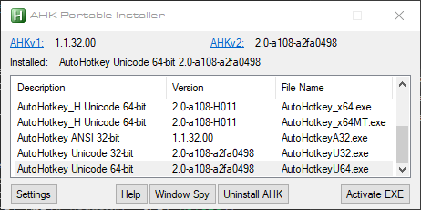

# AHK Portable Installer (now completely portable)



For details on how to use Fully Portable Mode, skip to that section below.

## Intro

[Posted on AutoHotkey.com Forums](https://www.autohotkey.com/boards/viewtopic.php?f=6&t=73056)

If you need a version of `Window Spy for AHK v2` go to [this thread](https://www.autohotkey.com/boards/viewtopic.php?f=83&t=72333) on AHK forums.

If you want the latest version of `Ahk2Exe`, you can get it from the latest official AHK v1 zip, or from [here](https://github.com/AutoHotkey/Ahk2Exe).

The latest versions of AutoHotkey_H v1 and v2 have and updated `Ahk2Exe.exe` included.

This is a (semi) portable install manager.  This script is meant to work with the portable `.zip` archives of AutoHotkey, NOT the setup `.exe` versions.  It is written in AHK v2.

This script is now supported uncompiled, since McAffee has decided that some of the key exe files are supposedly viruses (a false positive of course).  Running this as a script should mitigate this issue.  See `Basic Setup` for details.

## Features
* Now featuring Fully Portable Mode.  See the `Fully Portable Mode` section below.\
Middle-click on selected script files to run them (you can select multiple).\
Shift + Middle-click to open in specified editor.\
Many of the below features don't apply in Fully Portable Mode.  Read the Fully Portable Mode section for details.
* Associate the .ahk extension with any version of AHK on double-click.
* Selectively choose which context-menu items appear in the context menu.
* Associate any text editor with "Edit Script" in context menu easily.
* Define as many versions of AHK as you want to run in parallel.
* Automatically launch the appropriate compiler from "Compile Script" context menu.
* Checks for updates when prompted, or does so automatically if enabled.
* Displays the latest versions of AHK v1 and v2 (with internet connection of course).
* Displays currently active version of AHK.
* Provides links to AHK v1 and v2 download pages / version archives.
* Allows you to invoke `WindowSpy.ahk` and `help file` for active AHK version from GUI.
* Easy access to edit templates for new AutoHotkey.ahk files from GUI.

## Basic Setup

Grab the latest copy of AHK v2 alpha, copy the desired version of `AutoHotkey.exe` into the script dir and rename it to `AHK Portable Installer.exe`.  Always run this EXE file to launch the script.

The AutoHotkey `base folder` is intended to look something like this:

Example:
```
C:\AutoHotkey    <-- place the base folder anywhere you want
             \AHK Portable Installer\...   <-- main script should go here
             \ahk version blah\...         <-- AHK folders for each version
             \ahk_h another_version\...    <-- AHK folders for each version
             \etc\...                      <-- AHK folders for each version

Folder Name format:
    [name_no_spaces] [version_no_spaces] [additional_info_optional]

Examples:
    AutoHotkey v1.1.32.00
    AutoHotkey v2.0-a108-a2fa0498 extra_info not_used
    AutoHotkey_H v1.2.3.4
```

Separate name and version with a space.  There should be NO spaces in the NAME or VERSION in the folder name.  Note that most of the version info comes from the folder name, so type out the version as you want it to appear in the program.  The type (ANSI / UNICODE) and bitness (64/32 bit) comes from the EXE file, or in the case of AutoHotkey_H, it comes from the subfolder the EXE is in.  Don't modify the original structure of the `.zip` archives for any of the versions of AHK you intend to use.

In general, for best results, each subfolder should have it's own copy of a `help file`, `WindowSpy.ahk`, and `Compiler` folder with `Ahk2Exe` and all necessary support files (like `.bin` files or `mpress.exe` if you want to use it).

When you click `Activate EXE`, or double-click on a version in the list, this writes registry entries for the `.ahk` extension, context menu entries, and the template that corresponds to the major version (v1 or v2) of AutoHotkey.  The associated template will be automatically written to `C:\Windows\ShellNew\Template.ahk`.  The AHK_Launcher.exe (or .ahk) is used to dynamically launch the appropriate version of AHK based on your config settings in the <font color="red">AHK Launcher</font> tab.

For more info on how to setup multiple compilers with AHK Portable Installer, read more below in the <font color="red">Setting Up Ahk2Exe</font> section.

If you are using Fully Portable Mode, then read more about this mode below.  You can skip Ahk2Exe handler and AHK Launcher Tab sections, as these do not apply in Fully Portable Mode.

Note that SHIFT + MButton and MButton hotkeys now apply when using `explorer.exe` file browser windows.  If you are not using Fully Portable Mode this should have no significant effect, since there is no need to keep this script running unless you are changing settings, or implementing a new version of AHK into your system.  Also these hotkeys don't natively do anything on `explorer.exe` file browser windows.

## Ahk2Exe Handler

Advanced features in this module are currently under construction.  Currently it will only open the Ahk2Exe window with the script name and icon pre filled.

## AHK Launcher Tab

In the `AHK Launcher` tab, you can configure several (practically unlimited) versions of AutoHotkey and AutoHotkey_H to run side-by-side.  This works by parsing the first line of the script for a comment containing a match-string that specifies the version of AutoHotkey to use to run the script.  The user determines what the match-string is, decides to match via exact-match or regex, and decides what EXE to run for each specified match in this tab.  Once your settings are set, you won't have to change them again, unless you add/change a version of AHK for use.

When running a script, if a first line match is not found, the fallback operation is to launch the installed/activated version of AutoHotkey.

Changing these settings can be done on-the-fly.  Just close the GUI after you are done making changes in the <font color="red">AHK Launcher Tab</font> in order for the changes to take effect.

Use the plus/minus buttons to add/remove entries.  Double-click on a list item to edit it.

Key Notes:
* There are 9 default values to allow for running the following versions side by side:
  * AHK v1/2 64/32-bit/ANSI
  * AHK_H v1/2 32/64-bit
  * just specify the EXE to use for each one you intend to use.
* Spacing variations and optionally excluding the "v" for "v1" or "v2" is supported with default regex.

The default match-strings for AHK versions are regex.  Valid match strings to use as your first-line comment in your scripts are listed directly below.  Spacing variations can be used if desired, and the "v" (as in "v1" or "v2") is optional.

```
; AHK v1            <-- for 64-bit, optionally include "64-bit"
; AHK v1 32-bit
; AHK v1 ANSI
; AHK v2            <-- for 64-bit, optionally include "64-bit"
; AHK v2 32-bit
; AHK_H v1          <-- for 64-bit
; AHK_H v1 32-bit
; AHK_H v2          <-- for 64-bit
; AHK_H v2 32-bit
```

## Setting up Ahk2Exe

Remember, each version of AutoHotkey you configure to use with AHK Portable Installer should have its own compiler folder with `Ahk2Exe.exe` in it.

There isn't much to setting up the compiler for normal versions of AutoHotkey.  All versions of AutoHotkey v1 come with a compiler and `.bin` files, and `mpress.exe`.  These versions of `Ahk2Exe` also work for AutoHotkey v2.  Just copy `Ahk2Exe.exe` and `mpress.exe` from the AHK v1 compiler folder to the AHK v2 compiler folder.  Note, DO NOT copy over the `.bin` files from AHK v1 to AHK v2 folders.

The latest versions of AutoHotkey_H v1 and v2, as of the updating of this document (2014/04/16), both have an updated compiler which already contains `Ahk2Exe.exe`.

## Fully Portable Mode

To enable Fully Portable Mode, check the checkbox in the Options tab.  No admin rights are required in this mode.

When Fully Portable Mode is enabled, you can middle-click to run your selected AHK scripts on the desktop and in `explorer.exe` file browser windows.  You can select multiple files if you wish, then middle-click to run them all.  AHK Portable Installer must be running in the background for Fully Portable Mode to remain active.

You can open a selected script (from the desktop or `explorer.exe` file browser window) in your specified editor using SHIFT + Middle-click.  The Middle-click and Shift + Middle click hotkeys are now always active when AHK Portable Installer is running.

If you want AHK Portable Installer to run on startup, then check the "Run on system startup" checkbox in the Options tab.

Enabling this mode has the following effects:

* The main window list is directly used for switching AHK versions.  Simply double-click an item to make that version "active" for running future scripts.
* The `Use Ahk2Exe Handler` and `Use AHK Launcher` options in the Basics tab have no effect.
* Specifying a text editor in the Basics tab doesn't modify the registry (and no other registry modifications are made).
* The `AHK Launcher` tab has no effect.
* The first-line version comment in scripts (used by the AHK Launcher to determine which version of AHK to run) is not necessary, since AHK Launcher is not used.
* The options to show context menu items have no effect.

## What AHK Portable Installer does NOT do...

This is a PORTABLE installer, so this script:

* WILL NOT write or remove registry entries that deal with modifying the App list of installed programs.
* WILL NOT create a separate `.ahk2` extension or any other extension besides `.ahk`.
* WILL NOT automatically download new versions (at least for now).

## Troubleshooting

1) It is NOT recommended to run this script along side a normal installation of AutoHotkey with the setup program, it is however theoretically possible.  But this script will override the proper install with its own settings in the registry.

2) If you move your AutoHotkey folder, then you must "re-activate" your chosen AutoHotkey version.

## To-Do List

* explore options for fully portable mode
* improve some automation options with Ahk2Exe
* allow options to compile one script into multiple versions with minimal clicks

## Other remarks...

This program will NOT circumvent User Account Control settings.  If you leave UAC enabled, then you will likely be prompted when this program tries to write to the registry.  I leave it to the user to decide how to manage their UAC settings.

---

Any feedback would be appreciated.  Hopefully this tool will help people, and just get better over time.

If you need a version of Window Spy for AHK v2 go to [this thread](https://www.autohotkey.com/boards/viewtopic.php?f=83&t=72333) 
on AHK forums.
